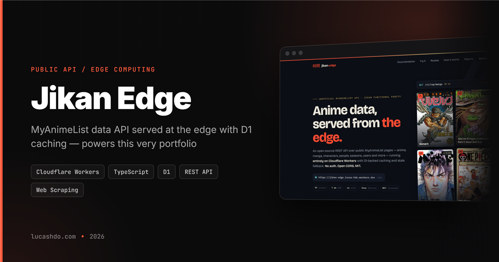

<p align="center">
  
</p>

# jikan-edge

**A [Jikan](https://github.com/jikan-me/jikan)-parity anime & manga REST API running entirely on Cloudflare Workers.**

Public MyAnimeList data — anime, manga, characters, people, producers, clubs, seasons, schedules, reviews, recommendations, user profiles and more — served from the edge with D1-backed caching, stale fallback, and per-route contract tests.

```
Base URL: https://jikan.lucashdo.com
```

The previous hostname, `https://jikan-edge.lucas-hdo.workers.dev`, still serves the same Worker and is not scheduled for removal — existing integrations keep working without a change.

## Quick start

```bash
# Anime detail
curl https://jikan.lucashdo.com/v1/anime/1

# Search with server-side filters
curl "https://jikan.lucashdo.com/v1/anime?q=naruto&type=movie"
curl "https://jikan.lucashdo.com/v1/anime?genres=1&score=9&order_by=score"

# Current season, weekly schedule, top rankings
curl https://jikan.lucashdo.com/v1/seasons/now
curl "https://jikan.lucashdo.com/v1/schedules?filter=monday"
curl "https://jikan.lucashdo.com/v1/top/anime?page=1"

# User profiles
curl https://jikan.lucashdo.com/v1/users/USERNAME/full
```

Every response is wrapped in `{ "data": ..., "meta": { cached, stale, refreshFailed, fetchedAt } }`. Errors return `{ "error": { code, message, requestId } }`.

## Route surface

97 GET routes under `/v1` (98 counting `/health`), covering **96 of the 100 endpoints** in Jikan
v4's published OpenAPI spec, plus one Jikan does not have (`/v1/people/{id}/news`):

| Group | Routes |
| --- | --- |
| Anime | search (with `type`/`status`/`rating`/`score`/`genres`/`order_by` filters), detail, full, characters, staff, episodes, episode detail, videos, pictures, statistics, news, forum, relations, themes, external, streaming, recommendations, reviews, moreinfo, userupdates, genre taxonomy (`?filter=genres\|explicit_genres\|themes\|demographics`) |
| Manga | search (with filters), detail, full, characters, pictures, statistics, news, forum, relations, external, recommendations, reviews, moreinfo, userupdates, genre taxonomy |
| Characters / People | detail, full, anime, manga, voices, pictures, news (people), search, top |
| Users | profile, full, about, statistics, favorites, updates, friends, clubs, reviews, recommendations, animelist, mangalist, search |
| Seasons | now, by year/season, upcoming, archive, weekly schedule (`?filter=monday..sunday\|other\|unknown`) |
| Clubs / Producers / Magazines | detail, members, staff, relations (clubs); directory + detail + full + external (producers); directory with `?q=` (magazines) |
| Watch / Reviews / Recommendations | recent + popular episodes/promos; paginated global reviews & recommendations |
| Random | anime, manga, characters, people, users |

The full route table with source pages, cache TTLs and per-route notes lives in [`docs/routes.md`](docs/routes.md).

## CORS

Fully open (`Access-Control-Allow-Origin: *`) — call the API directly from any browser frontend. Abuse control is handled by the rate limiter, not by origin restrictions.

## Rate limits

Two per-IP windows, enforced globally across all routes (mirroring Jikan's own policy):

- **30 requests / 10 seconds** (burst)
- **60 requests / minute** (sustained)

Exceeding either returns `429` with a `Retry-After` header.

## Caching

Fresh data is served straight from D1 without touching MyAnimeList. Cache misses fetch the public HTML page once, parse it, and persist the normalized result (TTL: 6 h for most resources, 2 h for user lists). If a refresh fails and a stale copy exists, the API answers `200` with `meta.stale: true` instead of erroring.

## Honest differences from Jikan

This project aims for **functional parity, not schema-identical cloning**.

### Not a drop-in replacement

Pointing a Jikan client at this base URL will not work. That is a deliberate choice — camelCase and
a flat envelope suit the JS/TS consumers this API has — but it is a choice, and it deserves to be
stated rather than discovered:

| | jikan-edge | Jikan v4 |
| --- | --- | --- |
| Envelope | `{ data, meta }` | `{ data, pagination }` |
| Field names | camelCase — `malId`, `titleEnglish` | snake_case — `mal_id`, `title_english` |
| Errors | `{ error: { code, message, requestId } }` | `{ status, type, message, error }` |
| Images | `imageUrl` + `images.{small,medium,large}` | `images.{jpg,webp}.{image,small_image,large_image}_url` |
| Dates | `{ from, to, string }` | `{ from, to, prop: { from: {…}, to: {…} }, string }` |
| Pagination | `meta.pagination` | top-level `pagination` |
| Items per page | 50 on top lists, a whole season in one response | 25, with a hard `limit=25` ceiling |
| Cache state | `meta.cached` / `stale` / `fetchedAt` + `X-Cache-Status` | not exposed |

Two things this API has that Jikan does not: **user anime and manga lists**, which Jikan deprecated
in May 2022 and gates behind a config flag, and `GET /v1/people/{id}/news`.

### Routes we can't serve (and why)

Each of these was investigated against the real MyAnimeList pages, with the evidence recorded in [`docs/routes.md`](docs/routes.md):

| Jikan route | Status here | Why |
| --- | --- | --- |
| `GET /clubs?q=` (club search) | `q` is ignored (index only) | `clubs.php?q=` performs **no** server-side filtering — any query returns the same list. MAL's real club search is an internal JS/AJAX endpoint, which this project's source policy forbids. |
| `GET /top/reviews` | Not served | MAL has no review ranking mechanism (no sort-by-helpful, day-only date granularity). Serving it would be `reviews/anime` wearing a costume. |
| `GET /users/{user}/history` | Not served | The MAL history page renders empty without login. `GET /v1/users/{user}/userupdates` covers the public equivalent from the profile page. |
| `GET /users/{user}/external` | Not served | The MAL profile exposes no structured external links to source it from. |
| `GET /users/userbyid/{id}` | Not served | Depends on a Jikan-internal ID-to-username mechanism with no public MAL page behind it. |
| Per-episode forum (`forum?filter=episode`) | Not served | No dedicated public page per episode discussion worth scraping reliably. |

### Known limitations on served routes

- `GET /anime/{id}/episodes` fetches only MAL's first page — very long series return a truncated list (upstream pagination format unconfirmed).
- `GET /anime/{id}/streaming` may return `[]` in production even when data exists: streaming availability is geo-dependent and MAL resolves Cloudflare's network to a different region.
- `GET /random/*` draws only from locally cached entries rather than the full MAL database (no mass ID scanning, by policy). Empty local catalog → `404 NO_LOCAL_ENTRIES`.
- Text-query searches with zero real matches mirror MAL's own fallback behavior (popular unrelated titles) instead of returning an empty list.

## Self-hosting

Your own instance on your own Cloudflare account. No API keys and no upstream credentials — the only
resource it needs is a D1 database, which the setup script creates and migrates for you.

```bash
git clone https://github.com/LucasHenriqueDiniz/jikan-edge.git && cd jikan-edge
npm install
npx wrangler login
npm run setup            # creates D1, writes its id into wrangler.jsonc, applies the migrations
npx wrangler deploy

curl https://<your-worker>.<your-subdomain>.workers.dev/health   # checks.database must read "ok"
```

The full guide — manual setup, troubleshooting, Free vs Paid plan limits, and what to change before
sending real traffic to MyAnimeList — is in [`docs/self-hosting.md`](docs/self-hosting.md).

## Development

```bash
npm install
npm run db:migrate:local
npm run dev:local     # local simulator
npm test              # unit tests
npm run test:integration
npm run benchmark     # parser p95 smoke tests
```

Architecture, source policy and local-dev details: [`docs/`](docs/README.md).

Breaking changes and fixes that affect consumers are listed in [`CHANGELOG.md`](CHANGELOG.md).

## Landing site

The public landing page (jikan.moe-style, with a live request demo) lives in [`site/`](site/index.html) and is served by the same Worker via Cloudflare static assets: `/` serves the site, `/v1/*` and `/health` fall through to the API. No build step — it's a single static HTML file deployed together with `wrangler deploy`.

## Disclaimer

Not affiliated with MyAnimeList or Jikan. All data is collected from publicly accessible MyAnimeList pages, cached aggressively, and rate-limited to keep upstream load minimal. If you are MyAnimeList and have concerns, please open an issue.

## License

[MIT](LICENSE)
